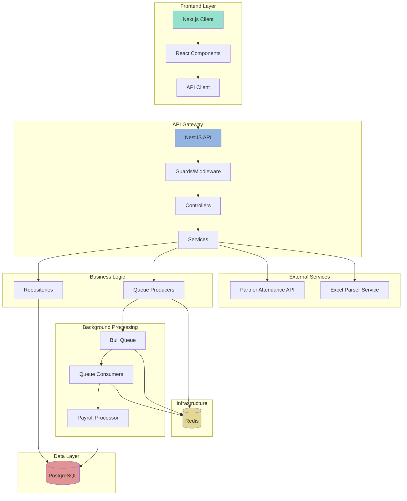

# 🏢 Payroll Management System

An enterprise-grade payroll management system built with NestJS and Next.js, designed for high scalability and maintainability. This solution automates payroll processing by integrating with third-party attendance management APIs, eliminating manual data handling and reducing errors. 

It supports weekly, bi-weekly, and monthly payroll calculations for over 100,000 companies, processing inputs like worked hours, overtime, medical leaves, and absences. Engineered with clean architecture and best practices, this system enhances payroll administrators' efficiency, especially when managing multiple companies.

## 👨‍💻 Author

**Rhema Musibwe** (https://github.com/rhema1506))

## 🎯 Overview

This project showcases modern software engineering practices through a real-world payroll system implementation:

- Clean Architecture principles
- Queue-based processing for scalability
- Real-time monitoring
- Test-driven development
- Comprehensive documentation

## 🏗️ Architecture



## 🔄 Data Flow

1. **Frontend Flow**
   - Next.js client renders UI components
   - React components handle user interactions
   - API client manages backend communication

2. **API Gateway**
   - Guards/Middleware handle authentication and validation
   - Controllers route requests to appropriate services
   - Services orchestrate business logic

3. **Business Logic**
   - Repositories manage data persistence
   - Queue producers handle async job creation via Bull Queue
   - External service integration

4. **Background Processing**
   - Bull Queue manages job queuing in Redis
   - Queue consumers process async tasks
   - Payroll processor handles calculations

5. **Data Layer**
   - PostgreSQL stores application data
   - Redis manages queue state and job processing
   - Data consistency across services

## 🛠️ Technology Stack

### Frontend Layer
- Next.js 14+
- React 18
- TailwindCSS
- TypeScript

### Backend Layer
- NestJS
- Bull Queue
- TypeORM
- Class Validator
- Swagger/OpenAPI

### Data Layer
- PostgreSQL (Main Database)
- Redis (Queue Management)

### DevOps
- Docker & Docker Compose
- Environment Configuration
- Health Checks

## ⚡ Key Features

- **Async Processing**: Bull Queue implementation for payroll calculations
- **Real-time Monitoring**: Bull Board integration
- **API Documentation**: OpenAPI/Swagger integration
- **Type Safety**: TypeScript throughout the stack
- **Data Validation**: Class-validator implementation
- **Error Handling**: Global exception filters
- **Security**: JWT, Helmet, Rate limiting

## 🚀 Quick Start

```bash
# Start services
make build
make up
```

Access points:
- 🖥️ Frontend: http://localhost:3000
- 🔌 API: http://localhost:3001
- 📊 Queue Monitor: http://localhost:3001/admin/queues
- 📚 API Docs: http://localhost:3001/api

## 💻 Development

```bash
# Install dependencies
make install

# Run tests
make test

# Run linter
make lint

# Access containers
make shell-backend
make shell-frontend
```

## 🏛️ Project Structure

```
.
├── backend/
│   ├── src/
│   │   ├── payroll/          # Payroll domain
│   │   ├── attendance/       # Attendance domain
│   │   ├── common/          # Shared utilities
│   │   └── main.ts          # Application entry
│   └── test/                # Test suites
├── frontend/
│   ├── src/
│   │   ├── components/      # React components
│   │   ├── pages/          # Next.js pages
│   │   └── services/       # API services
│   └── tests/              # Frontend tests
└── docker-compose.yml      # Container orchestration
```

## 🛠️ Best Practices Implemented

1. **Clean Architecture**
   - Domain-driven design
   - Separation of concerns
   - Dependency injection

2. **Testing Strategy**
   - Unit tests
   - Integration tests
   - E2E tests

3. **Code Quality**
   - ESLint configuration
   - Prettier formatting
   - Git hooks (husky)

4. **Performance**
   - Async job processing
   - Caching strategies
   - Database indexing

5. **Security**
   - Input validation
   - Rate limiting
   - JWT authentication
   - CORS protection

## 📚 Documentation

- [Demo Guide](DEMO.md) - Interactive demonstration
- [API Documentation](http://localhost:3001/api) - OpenAPI/Swagger
- [Queue Monitor](http://localhost:3001/admin/queues) - Bull Board

## 🤝 Contributing

1. Fork the repository
2. Create your feature branch
3. Commit your changes
4. Push to the branch
5. Create a Pull Request
